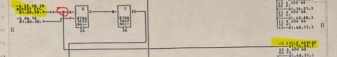
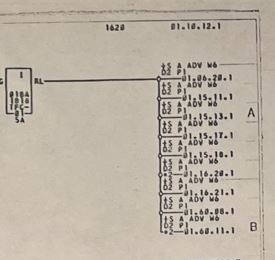

The Alder utility is a kind of "synthesizer" that converts hardware described
in the ALD2 HDL format to either a SPICE netlist or a Verilog module file.

## Notes on Cross-Sheet References

The left-most and right-most edges of the ALD diagrams contain 
information about cross-sheet references. 

Reference text can span more than one line.

References are accompanied by a page number that the wire 
continues on. In this way, a helpful cross-reference is established.

The ALDs reserve 15 columns to represent the 
reference names, however longer names can wrap
onto two lines. It appears that the IBM Printing
Program is smart enough to wrap on a space to 
avoid hyphenation.

### Left Side References

There are two types of connections to a left-side reference:
* A wire from a left-side reference to a set of logic block
input pins.
* A wire from a left-side reference to a set of right-side
references, possibly with different names. 

Combinations of these two situations are allowed as well.

### Right Side References

There are two types of connections to a right-side reference:
* A wire from a right-side reference to a logic block
output pin, or in rare cases to more than one output pin in the case
of "wire logic" dot-or or dot-and situations.
* A wire from a right-side reference to one left-side
reference, possibly with a different name. 

The case where the same wire gets two different names is tricky, but
it can happen. This case is an example:

On the left a reference is made to a signal called -S CE SW 10 REPEAT CYC
and that signal is used as an input on block 2B. However, notice that 
a right side reference is also created for the same signal, assigning a
name -S CYCLE REPEAT. As far as I can tell, both names represent exactly
the same electrical signal.

The same right-side reference may be repeated multiple times in the
case where the wire is used on multiple sheets.  This doesn't change
anything from an electrical standpoint, but it allows the complete
"cross reference" to be represented.  Here's an example of a case 
where the same named wire is referenced on more than 10 different pages:

### Algorithm Used by Alder

After all ALD2 files are parsed a logical cross-link phase is used to 
establish direct lines between all pins in the model. Obviously, cross-sheet references 
are needed to make these connections. There are two goals of the 
cross-link phase:
1. Give every pin in the model a list of the specific pins to which it
is electrically connected. This is critical information that is used during
synthesis phases.
2. Tag pins with associated reference name(s) where relevant. This provides convenience 
but doesn't provide any electrical information.

#### Step 1

